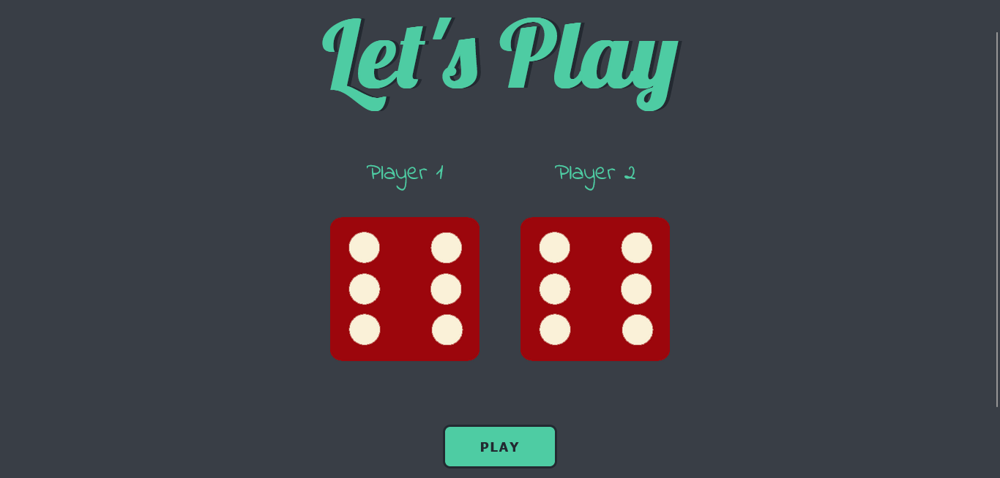

# Dicee Game

This is a solution to the dicee game challenge from the [Complete Web Development Bootcamp](https://www.udemy.com/course/the-complete-web-development-bootcamp/?src=sac&kw=the+complete+web+de).

## Table of contents

- [Overview](#overview)
  - [The challenge](#the-challenge)
  - [Screenshot](#screenshot)
  - [Links](#links)
- [My process](#my-process)
  - [Built with](#built-with)
- [Author](#author)

## Overview

### The challenge

Create a functional dicee game that displays the winner or calls a draw. Angela, the course instructor walks us thru the solution, but I decided to do my own version of it and chose to use OOP instead of her original idea.

### Screenshot

### Links

- Live Site URL: [Check it here](https://dice-game-xi-seven.vercel.app/)

## My process

### Built with

- Vanilla JavaScript
- Object Oriented Programming

## Author

- LinkedIn - [Marcelo Oliveira](www.linkedin.com/in/marcelo-ferreira-de-oliveira)
